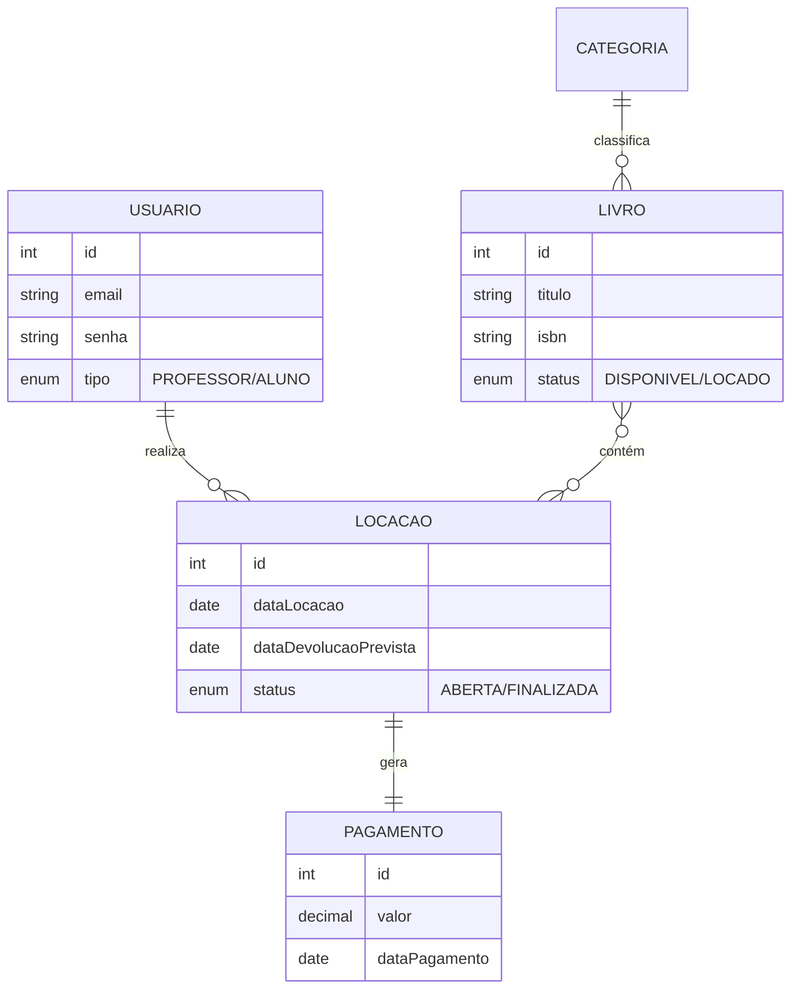

# 📚 Sistema de Biblioteca — Spring Boot + JavaFX

> Uma evolução do projeto clássico, agora migrado para **Spring Boot 3** com interface gráfica **JavaFX**.
> O foco deste projeto é demonstrar a **integração de Injeção de Dependência em aplicações Desktop**, segurança com **Spring Security** e persistência automatizada com **Spring Data JPA**.

---

## 🚀 Objetivo do Projeto

Criar um **sistema desktop moderno** para gestão de bibliotecas, contemplando:

- 🖥️ Interface Gráfica (**GUI**) responsiva construída com FXML.
- 🔐 Sistema de **Login e Autenticação** com criptografia de senhas.
- 🔄 Ciclo completo de **Empréstimo e Devolução** com cálculo automático de multas/valores.
- 📊 Relatórios de **Faturamento** por período.
- 🐳 Ambiente de execução containerizado com **Docker**.

---

## 🏛️ Entidades e Relacionamentos

O domínio do sistema permanece fiel às regras de negócio, mas agora enriquecido com Enums e anotações modernas:

| Entidade | Descrição | Relacionamentos |
|------------|------------|----------------|
| **Usuario** | Cliente ou Admin (Tipos: Aluno, Professor, Admin). | 1 → * Locacoes |
| **Categoria** | Gênero literário (ex: Tecnologia, Romance). | 1 → * Livros |
| **Livro** | Obra física com controle de estoque (Status). | * → * Locacoes / 1 → Categoria |
| **Locacao** | O contrato de empréstimo (datas e prazos). | * → Livros / 1 → Usuario / 1 → 1 Pagamento |
| **Pagamento** | Registro financeiro do fechamento da locação. | 1 → 1 Locacao |

### 🔗 Diagrama de Classes


 ## 💡 Insights Arquiteturais

### 🔹 1. Integração Spring + JavaFX (O Diferencial)
Diferente de aplicações JavaFX comuns, aqui **não instanciamos Controllers manualmente**.
* Utilizamos um `SpringApplicationBuilder` para iniciar o contexto do Spring junto com a GUI.
* Um `FxmlLoader` customizado injeta as dependências (`Services`, `Repositories`) diretamente nos Controllers da tela (`@RequiredArgsConstructor`).

### 🔹 2. Camada de Persistência (Repository Pattern)
Substituímos os DAOs manuais e o `EntityManager` puro pela interface `JpaRepository`:
* **Produtividade:** Métodos como `save`, `findById`, `delete` já vêm prontos.
* **Derived Queries:** Métodos customizados criados apenas pelo nome, ex: `findByDataPagamentoBetween(inicio, fim)` para o relatório financeiro.

### 🔹 3. Regras de Negócio e Segurança
* **Criptografia:** Senhas salvas no banco são hashadas com **BCrypt**.
* **Prazos Dinâmicos:**
    * 🎓 **Aluno:** 7 dias para devolução.
    * 👨‍🏫 **Professor:** 15 dias para devolução.
* **Controle de Estado:** Ao emprestar, o livro vira `LOCADO`. Ao devolver, vira `DISPONIVEL` automaticamente.

🛠️ Tecnologias e Dependências
| Tecnologia | Função |
|-------------|--------|
| **Java 17** | Linguagem LTS |
| **Spring Boot 3** | Framework principal |
| **JavaFX 17** | Interface Gráfica (GUI) |
| **Spring Data JPA** | Abstração de persistência |
| **Docker Compose** | Orquestração de containers |
| **PostgreSQL** | Banco de Dados Relacional |
| **Lombok** | Redução de código boilerplate |

## ⚙️ Como Executar o Projeto
```
### 🧩 Opção 1: Via Docker (Recomendado)
*Ideal se você não quiser configurar o banco de dados manualmente.*

1. Certifique-se de ter o **Docker** instalado.
2. Na raiz do projeto, abra o terminal e execute:

bash
docker-compose up --build
O sistema subirá o banco e a aplicação automaticamente.

🧩 Opção 2: Via IDE (Local)
1. Certifique-se de ter um PostgreSQL rodando na porta 5432.

2. Crie o banco de dados:
    SQL
    CREATE DATABASE biblioteca;

3.Execute a classe principal: org.primeiroprojetocursooo...ProjetoBancoDeDados2BibliotecaApplication
```
### 🔑 Acesso Inicial (Seed Data)

O sistema cria automaticamente um administrador e dados de teste na primeira execução:

| Credencial | Valor |
| :--- | :--- |
| **Email** | `admin@email.com` |
| **Senha** | `123456` |

---

## 📖 Fluxo de Uso (GUI)

### 🔁 1. Login e Dashboard
* O usuário acessa com as credenciais seguras.
* O sistema carrega o menu lateral dinamicamente conforme as permissões do usuário.

### 📚 2. Realizar Empréstimo
* Seleciona-se um **Usuário** e múltiplos **Livros** (adicionando ao Carrinho).
* O sistema valida se o livro já está locado.
* Ao confirmar, define a data de devolução automaticamente baseada no tipo de usuário (**Professor** / **Aluno**).

### 💰 3. Devolução e Faturamento
* Na tela de histórico, seleciona-se a locação.
* O sistema calcula o total: `(Dias Corridos * Preço dos Livros)`.
* Confirma-se o pagamento e os livros voltam a ficar **DISPONÍVEIS**.

---

## 🧠 Conclusão

Este projeto representa um salto de maturidade no desenvolvimento Java, demonstrando:

* ✅ Evolução do **JPA Puro** para **Spring Data**.
* ✅ Saída do Console para **Interface Gráfica (Desktop)**.
* ✅ Adoção de Arquitetura de Containers (**Docker**).
* ✅ Manutenção da **Clean Architecture**, isolando Regras de Negócio (*Services*) da Interface (*Controllers*).

> 💬 *Um exemplo prático de como modernizar sistemas legados ou criar aplicações Desktop robustas com o poder do Spring Boot.*

---

## ✨ Autor

<div align="center">

**Erick Geovane**

[](mailto:erickgeovane2002@gmail.com)
[](https://www.linkedin.com/in/erick-geovane)
[](https://github.com/ErickGeovane0706)

*":)"* 🧩

</div>
